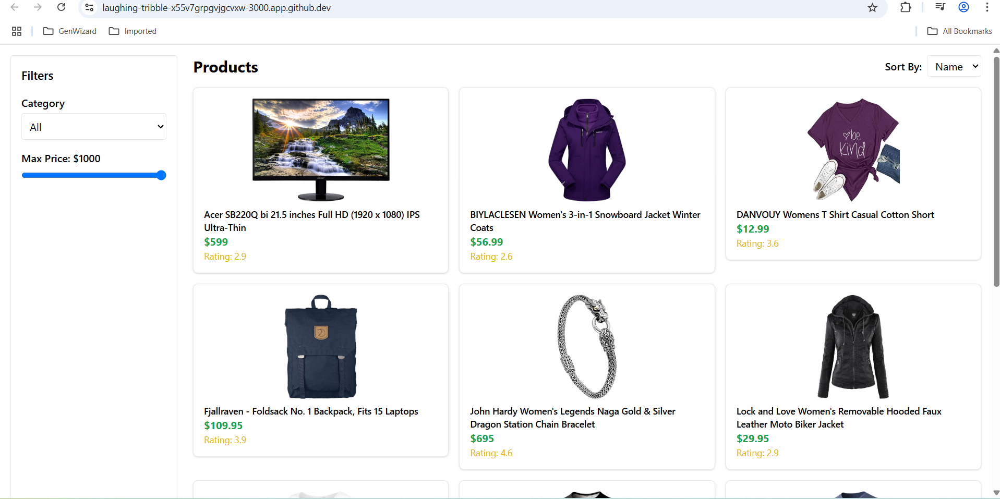

# 🛍️ Product Showcase Web App

A responsive frontend web application built with **React.js** and **Tailwind CSS** to display products fetched from a public API. The app supports filtering, sorting, and pagination to enhance user experience.

---

## 🚀 Features

- ✅ Fetches data from [FakeStoreAPI](https://fakestoreapi.com)
- ✅ Filter by category and price range
- ✅ Sort products by price, name, or rating
- ✅ Pagination support
- ✅ Responsive design using Tailwind CSS
- ✅ Routing with `react-router-dom`

---

## 📸 Screenshots


### Home Page (with Filters and Sorting)


### Product Cards
)

### Pagination
)


---

## 🧑‍💻 Tech Stack

- React.js
- Tailwind CSS
- Vite
- React Router DOM
- Fake Store API

---

## ⚙️ Setup Instructions

Follow the steps below to run this project locally:

### 1. Clone the Repository

```bash
git clone https://github.com/akashgupta6630/product-showcase-app.git
cd product-showcase-app
2. Install Dependencies
bash
Copy
Edit
npm install
3. Start the Development Server
bash
Copy
Edit
npm run dev
The app will start at http://localhost:3000 (or the port shown in terminal).

📁 Folder Structure
css
Copy
Edit
src/
│
├── components/
│   ├── FilterSidebar.jsx
│   ├── ProductCard.jsx
│   └── SortOptions.jsx
│
├── pages/
│   └── HomePage.jsx
│
├── App.jsx
├── main.jsx
└── index.css
